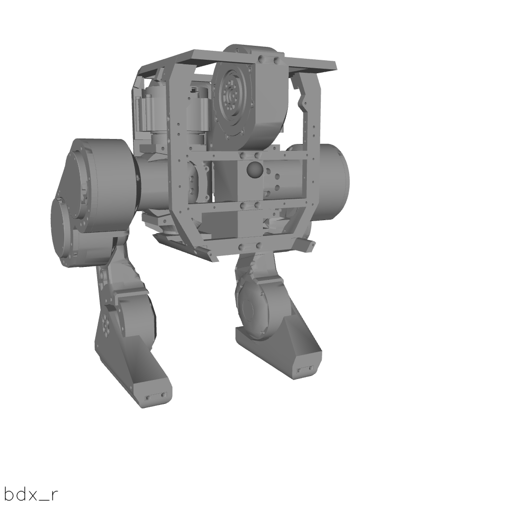
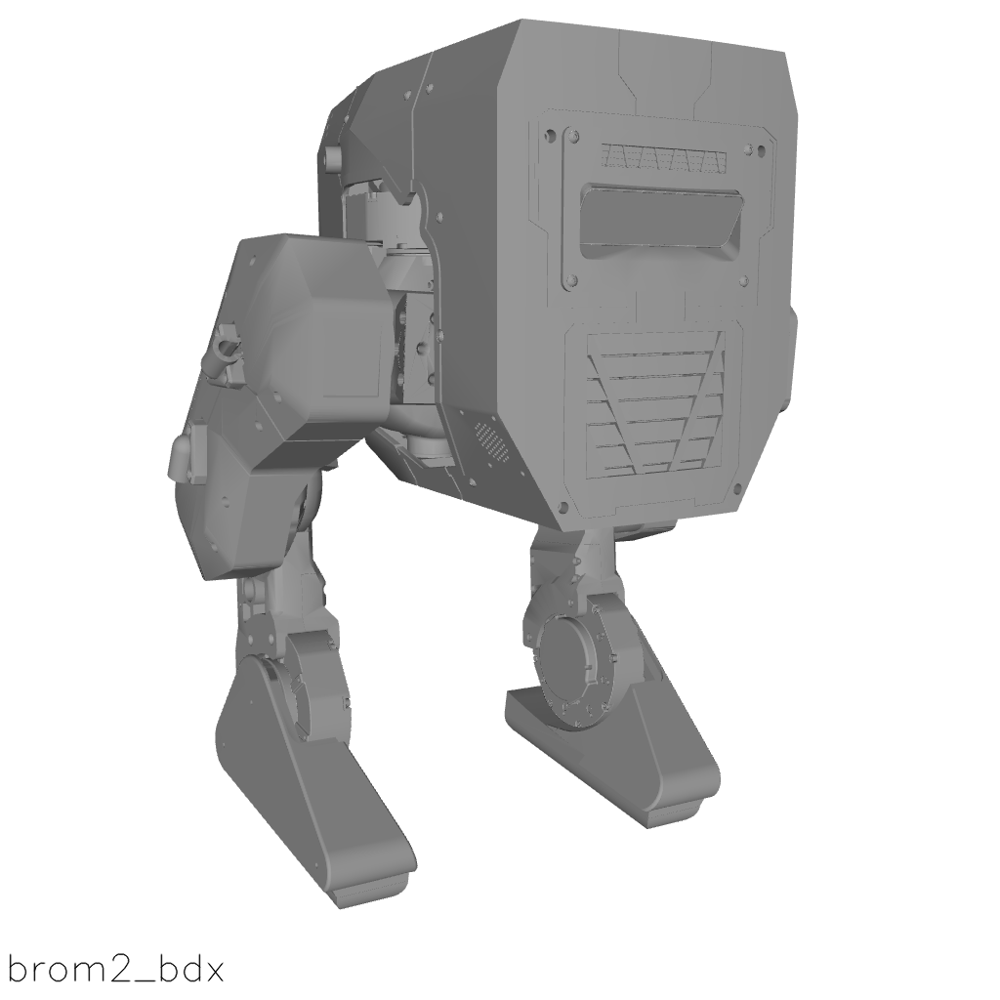
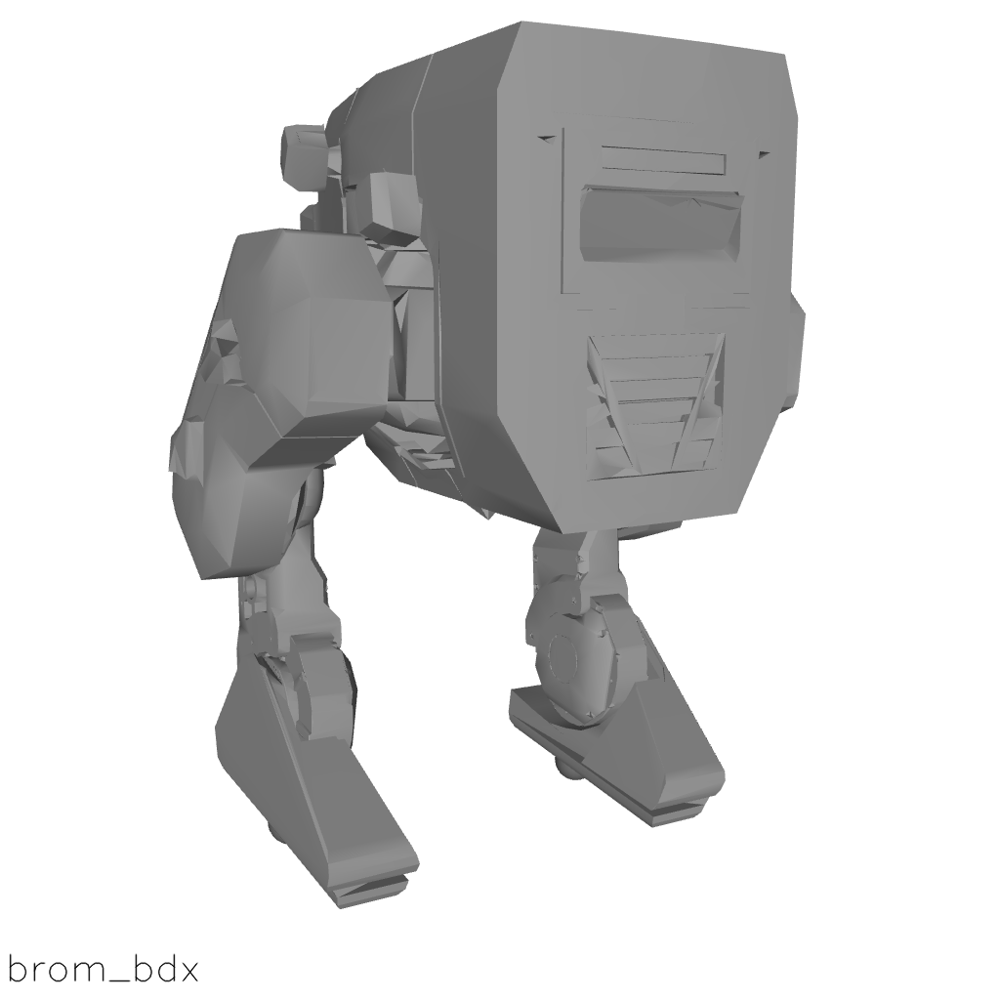
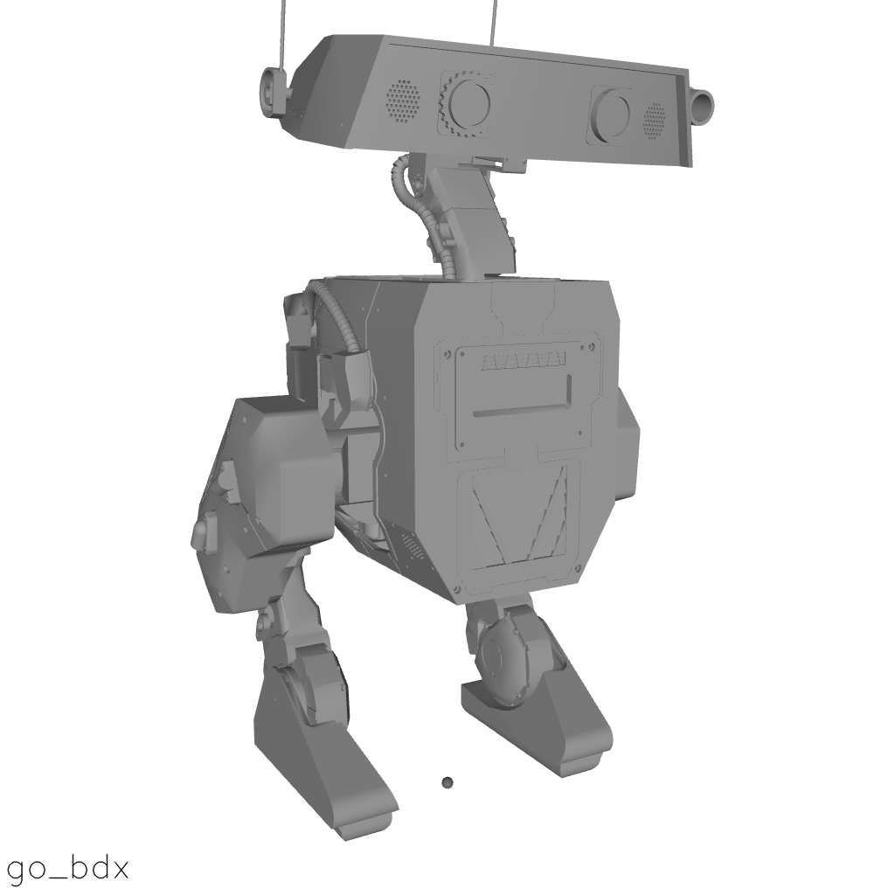
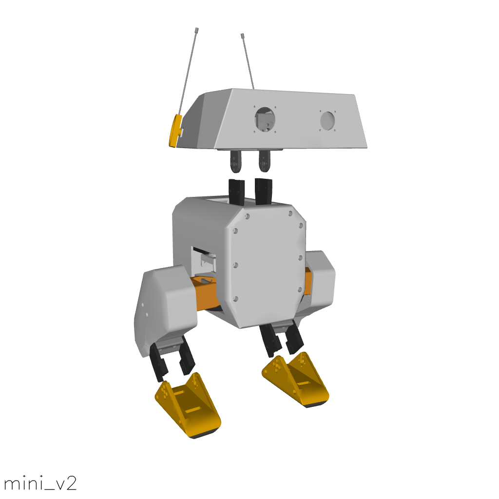
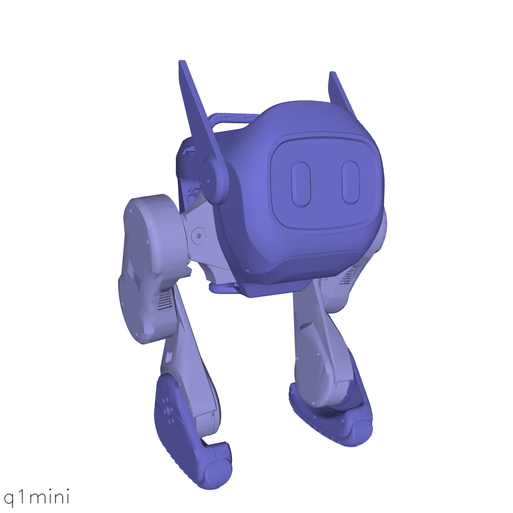
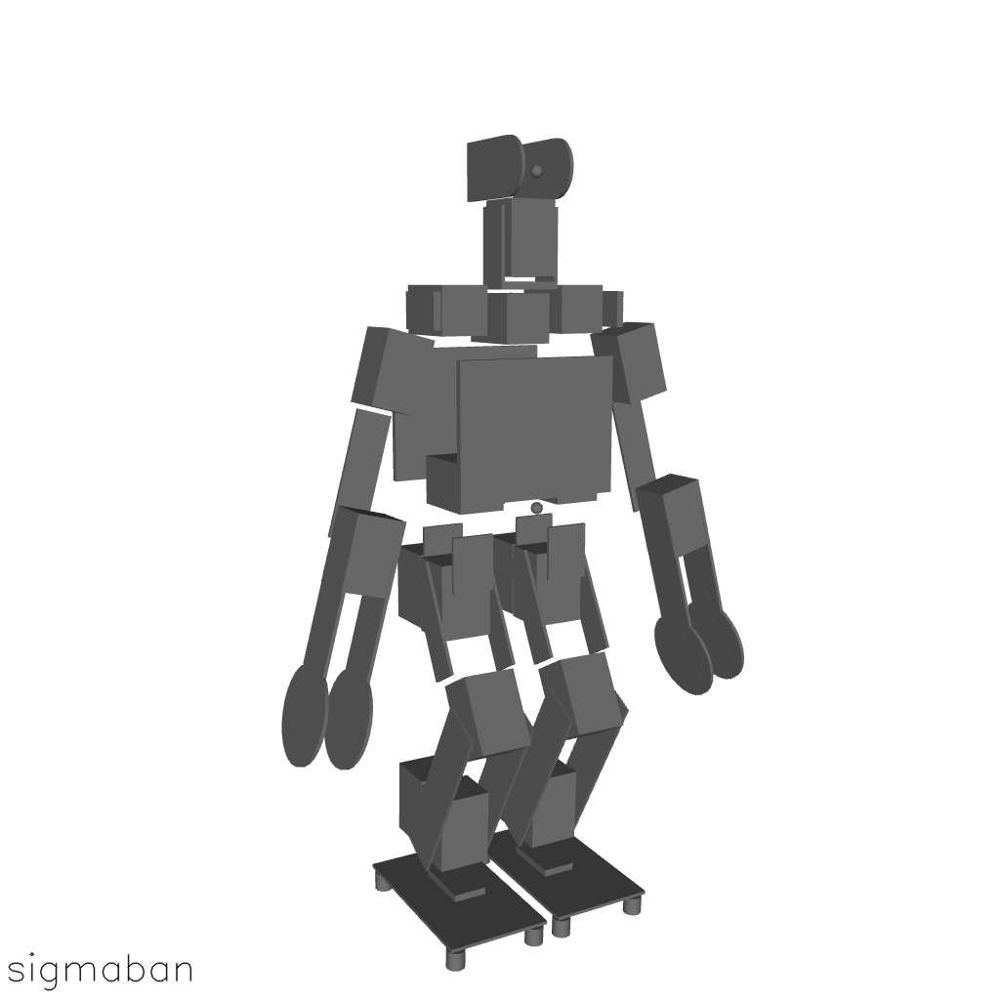
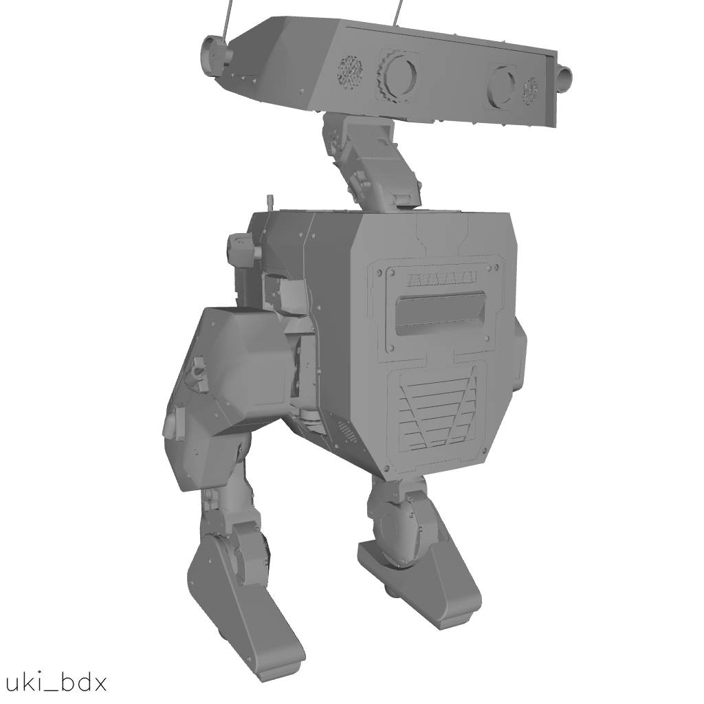

<h1>
  <a href="#"></a>
</h1>

[](https://github.com/openbiped/Automagerie/actions/workflows/build.yml) [](https://opensource.org/licenses/Apache-2.0)
 [](https://discord.gg/Rcx2DDF3MT) [](https://github.com/openbiped/Automagerie/issues/new/choose)

**Automagerie** is a deliberate coinage derived from:

- “Auto- / Automaton” → emphasizes self-operating machines and robotic agents.
- “Menagerie” → emphasizes a collection or repository of diverse, often exotic, creatures.

It is a repository of robot models and reference motion generator based on [Placo](https://github.com/Rhoban/placo). 

The reference motions are used in three RL works:
- [Open Duck Playground](https://github.com/apirrone/Open_Duck_Playground)
- [AWD](https://github.com/rimim/AWD)

### Gallery

|<a href='robots/bdx_r'></a>|<a href='robots/brom2_bdx'></a>|<a href='robots/brom_bdx'></a>|
| :---: | :---: | :---: |
|<a href='robots/go_bdx'></a>|<a href='robots/mini_v2'></a>|<a href='robots/q1mini'></a>|
|<a href='robots/sigmaban'></a>|<a href='robots/uki_bdx'></a>||

- [Getting Started](#getting-started)
  - [Installation](#installation)
  - [Generate motions](#generate-motions)
  - [Overview](#overview)
  - [Usage](#usage)
    - [Via `git clone`](#via-git-clone)
- [Automagerie Models](#automagerie-models)
- [Citing Automagerie](#citing-automagerie)
- [Acknowledgments](#acknowledgments)
- [Changelog](#changelog)
- [License and Disclaimer](#license-and-disclaimer)

## Getting Started

### Installation 

Install uv

```bash
curl -LsSf https://astral.sh/uv/install.sh | sh
```

### Generate motions

```bash
uv run scripts/auto_waddle.py (-j?) --duck ["go_bdx", "mini_v2", ...] (--num <> / --sweep) --output_dir <>
```

Args : 
- `-j?` number of jobs. If `j` is not specified, will run sequentially. If `j` is specified without a number, your computer will crash :) (runs with all available cores). Use `j4` for example
- `--duck` selects the duck type
- `--sweep` generates all combinations of motion within the ranges specified in `robots/<robot>/auto_gait.json`
- `--num` generates <num> random motions
- `--output_dir` self explanatory

### Replay

```bash
uv run scripts/replay_motion.py -f recordings/<file>.json
```

### Playground 

```bash
uv run motion_generator/gait_playground.py --duck ["go_bdx", "mini_v2", ...]
```

### Overview

The structure of Automagerie models is illustrated below. For brevity, we have only
included one model directory since all others follow the exact same pattern.

```bash
├── go_bdx
│   ├── assets
│   │   ├── base_0.stl
│   │   └── ...
│   ├── auto_gait.json
│   ├── go_bdx.urdf
│   ├── go_bdx.png
│   ├── go_bdx.xml
│   ├── placo_defaults.xml
│   ├── placo_presets
│   │   ├── slow.json
│   │   ├── medium.json
│   │   └── fast.json
│   ├── LICENSE
│   ├── README.md
│   └── scene.xml
```

- `assets`: stores the 3D meshes (.stl or .obj) of the model used for visual and
  collision purposes
- `LICENSE`: describes the copyright and licensing terms of the model
- `README.md`: contains detailed steps describing how the model's MJCF XML file
  was generated
- `<model>.urdf`: contains the URDF definition of the model
- `<model>.xml`: contains the MJCF definition of the model
- `scene.xml`: includes `<model>.xml` with a plane, a light source and
  potentially other objects
- `<model>.png`: a PNG image of `scene.xml`

Note that `<model>.xml` solely describes the model, i.e., no other entity is
defined in the kinematic tree.

### Usage

#### Via `git clone`

You can also directly clone this repository in the directory of your choice:

```bash
git clone https://github.com/openbiped/Automagerie.git
```

You can then interactively explore the model using the Python viewer:

```bash
python -m mujoco.viewer --mjcf robots/mini_v2/scene.xml
```

## Automagerie Models

**Ducks.**

| Name | DoFs    | License | MJX |
|------|---------|---------|-----|
| bdx_r | 10 | [MIT](robots/bdx_r/LICENSE) |✔️|
| brom_bdx | 10 | [Apache-2.0](robots/brom_bdx/LICENSE) |✔️|
| brom2_bdx | 10 | [Apache-2.0](robots/brom2_bdx/LICENSE) |✔️|
| go_bdx | 14 | [Apache-2.0](robots/go_bdx/LICENSE) |✔️|
| mini_v2 | 14 | [Apache-2.0](robots/mini_v2/LICENSE) |✔️|
| q1mini | 10 | [MIT](robots/q1mini/LICENSE) |✔️|
| uki_bdx | 14 | [Apache-2.0](robots/uki_bdx/LICENSE) |✔️|


**Humanoids.**

| Name | DoFs    | License | MJX |
|------|---------|---------|-----|
| sigmaban | 20 | [Apache-2.0](robots/sigmaban/LICENSE) |✔️|


## Citing Automagerie

If you use Automagerie in your work, please use the following citation:

```bibtex
@software{automageriegithub2025,
  author = {Antoine Pirrone, Grégoire Passault, Mimir Reynisson, Mankaran Singh and {Open Duck Contributors}},
  title = {{Automagerie: A collection of simulation models for Open Duck and motion generation}},
  url = {http://github.com/openbiped/Automagerie},
  year = {2025},
}
```

## Acknowledgments

The models in this repository build on the work of many talented third-party designers; Open Duck Automagerie exists thanks to their generous open-source contributions. We gratefully acknowledge every designer and engineer who made it possible.

The structure of this repository is also based on the hard work of [Kevin Zakka](https://kzakka.com/), with help from the Robotics Simulation team at Google DeepMind.

Thanks are due to contributors from across the community—find them all in [CONTRIBUTORS.md](./CONTRIBUTORS.md) for a full list.


## Changelog

For a summary of key updates across the repository, see the [global CHANGELOG.md](./CHANGELOG.md).

Each individual model also includes its own `CHANGELOG.md` file with model-specific updates, linked directly from the corresponding README.


## License and Disclaimer

XML and asset files in each individual model directory of this repository are
subject to different license terms. Please consult the `LICENSE` files under
each specific model subdirectory for the relevant license and copyright
information.

All other content is Copyright 2025 Mimir Reynisson and licensed
under the Apache License, Version 2.0. A copy of this license is provided in the
top-level LICENSE file in this repository.
You can also obtain it from https://www.apache.org/licenses/LICENSE-2.0.
