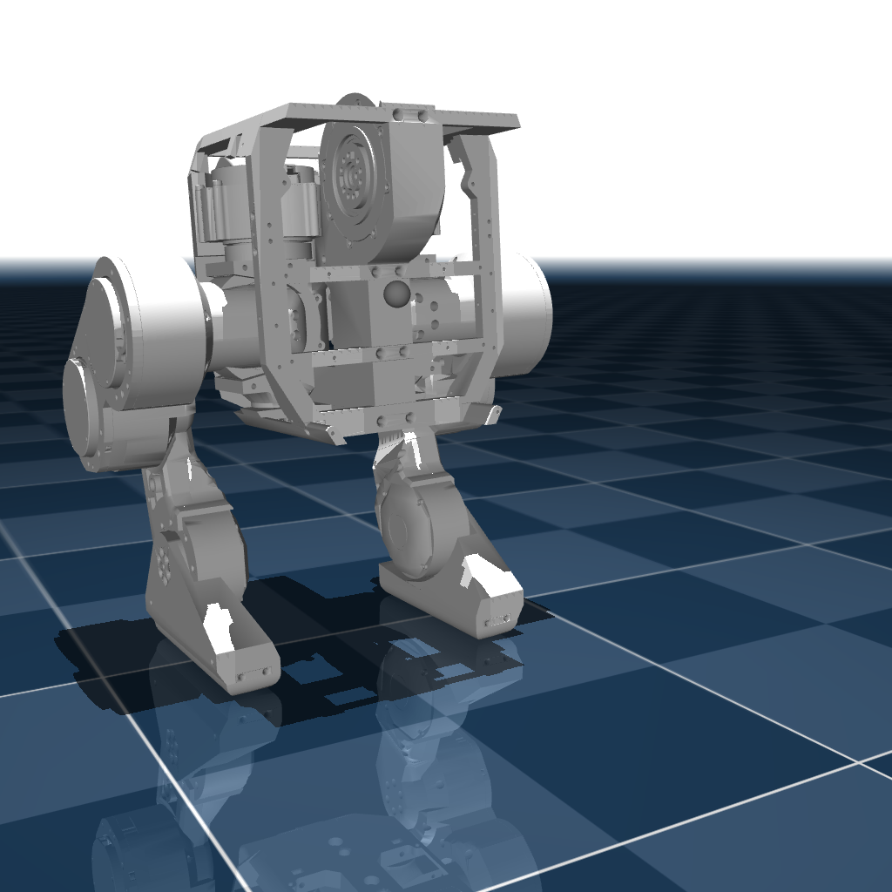

# BDX-R

## Changelog

See [CHANGELOG.md](./CHANGELOG.md) for a full history of changes.

## Overview

This package contains the model of the BDX-R Robot developed by Kayden Knapik (https://github.com/KaydenKnapik/BDX-R)

  

## License

This model is released under an [MIT](LICENSE).
