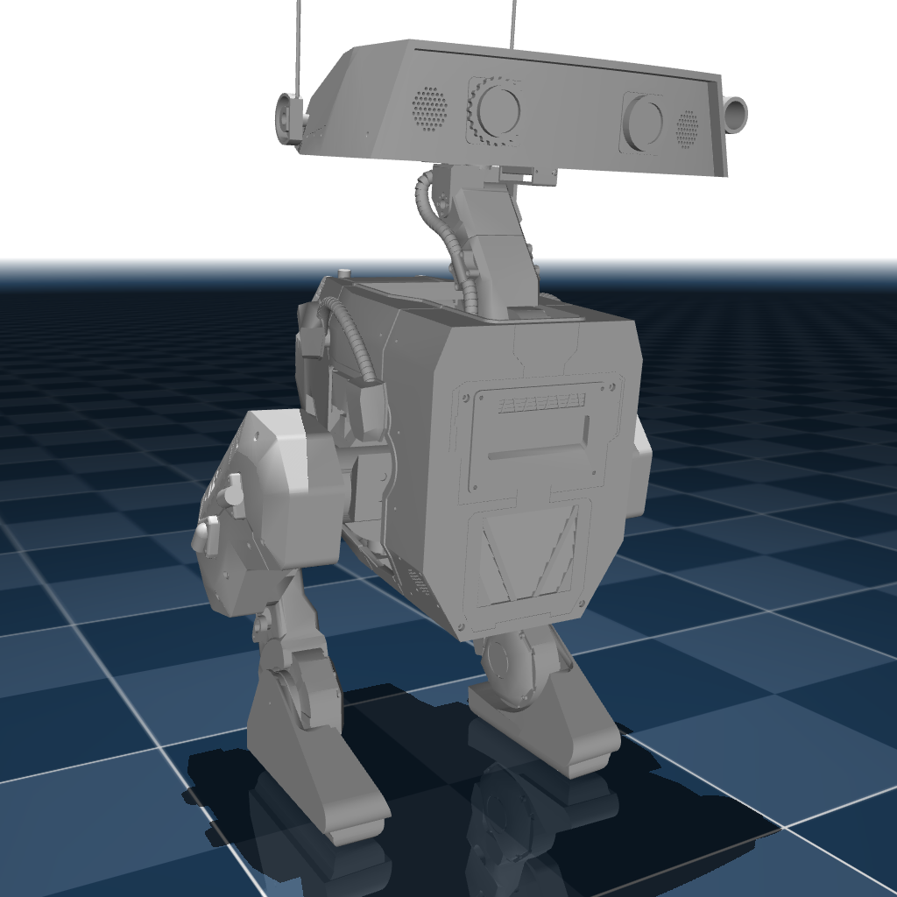

# Go-BDX

## Changelog

See [CHANGELOG.md](./CHANGELOG.md) for a full history of changes.

## Overview

This package contains the model of the Go-BDX Robot developed by [Alec Muir](https://github.com/roy86).

  

## License

This model is released under an [Apache-2.0](LICENSE).
