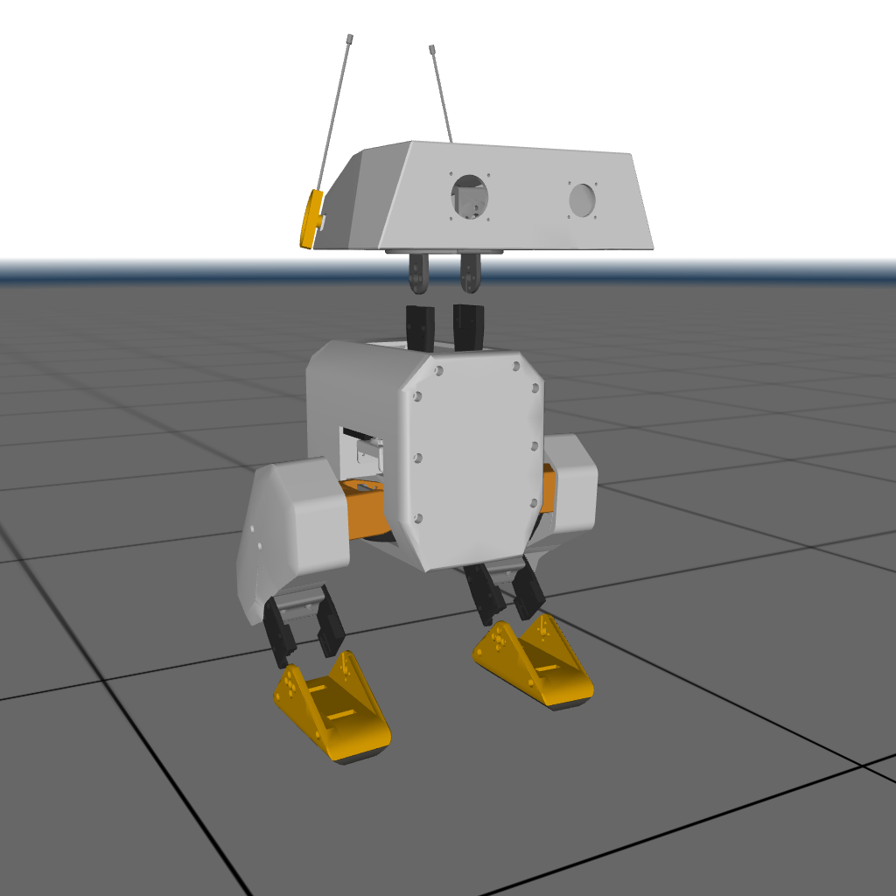
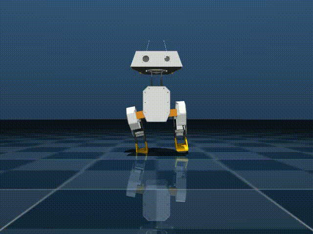

# Open Duck Mini v2

## Changelog

See [CHANGELOG.md](./CHANGELOG.md) for a full history of changes.

## Overview

This package contains the model of the Open Duck Mini v2 Robot developed by Antoine Pirrone.

  

## License

This model is released under an [Apache-2.0](LICENSE).
