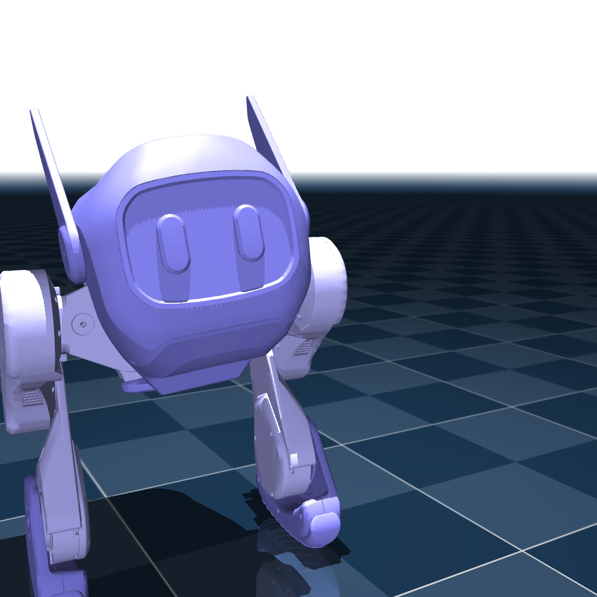

# Q1Mini

## Changelog

See [CHANGELOG.md](./CHANGELOG.md) for a full history of changes.

## Overview

This package contains the model of the Q1Mini Robot developed by: Kaiwen Li, Kunqi Zhang, Tiyu Fang, Wei zhang, Wenhao Tan, Xing Fang, Yanyun Chen

  

## License

This model is released under an [MIT](LICENSE).
