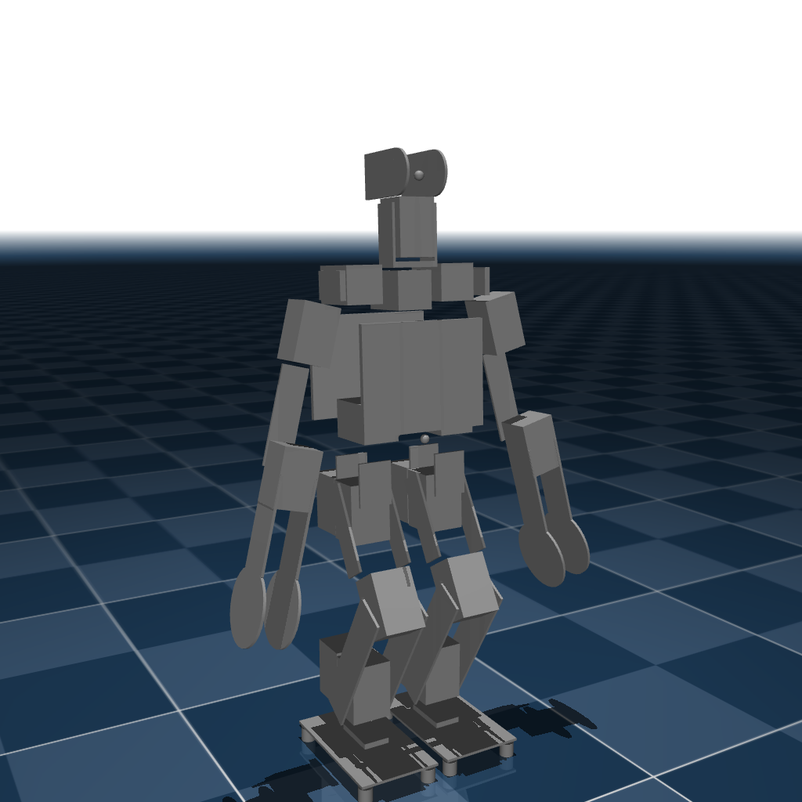

# Sigmaban2019 (MJCF)

> [!IMPORTANT]
> Requires MuJoCo 3.1.3 or later.

## Changelog

See [CHANGELOG.md](./CHANGELOG.md) for a full history of changes.

## Overview

This package contains the model of the Sigmaban2019 Robot developed by [Pollen Robotics](https://www.pollen-robotics.com/).

  

## License

This model is released under an [Apache-2.0](LICENSE).
